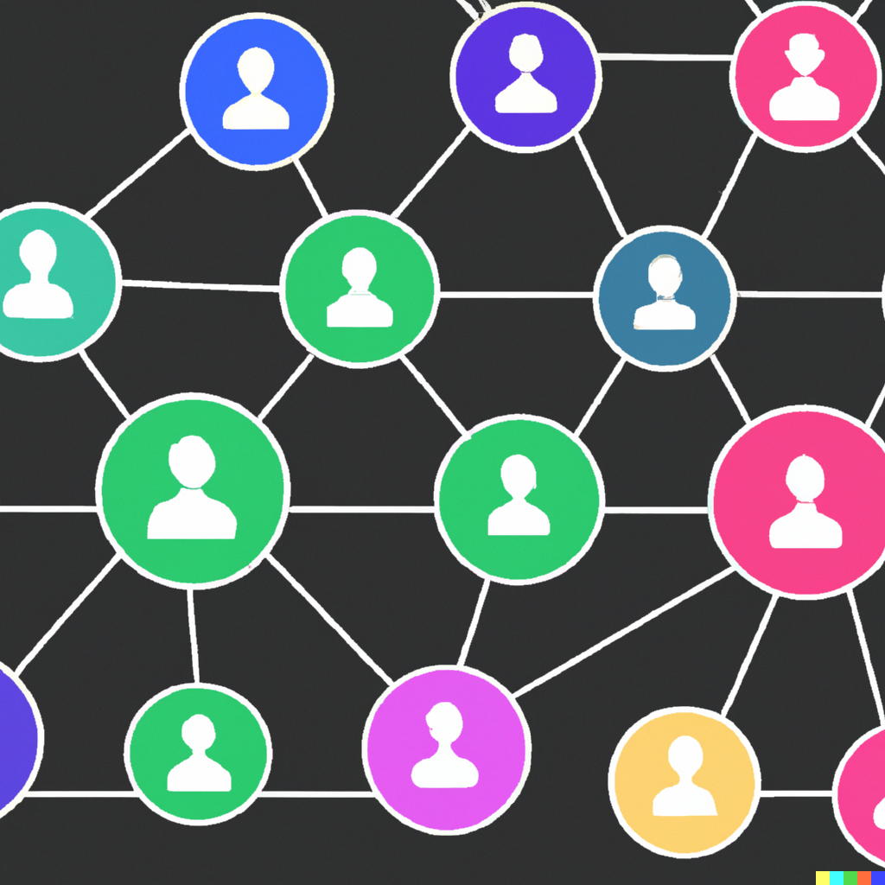

# Computational Social Science with Images and Audio

**ETH Zurich, Fall Term 2026, Course No. 851-0762-00L**

**Lecturers:** Elliott Ash, Andrea Ciccarone, and Philine Widmer

Welcome! This is the GitHub page for our class "Computational Social Science with Images and Audio" at ETH Zurich. This page is the syllabus of the 2026 edition. The material of this year's edition is in the folder [2026](2026/). The material of past editions, including student presentations and exams, is in the [archive](archive/).

  
   
  <i>Picture by Dall-E, prompted to give "a symbol for computational social science".</i>

## About the course

This course introduces a broad array of computer vision and audio analysis tools. Students will learn to apply these tools to a variety of problems. The applications will focus on social science contexts, including economics, politics, and law. Students will learn how to featurize audio and visual content, build models based on these features (e.g., for classification), and evaluate the models, both in terms of performance and societal implications.

Audio analysis and computer vision technologies have a considerable potential to generate new insights in the social sciences and assist decision-makers in various policy-relevant positions. At the same time, there are risks of adverse effects. For instance, such technologies could engrain or reinforce bias. They could also be abused, e.g., for surveillance or fraudulent/fake representations (such as deep fakes). The course enables students to develop their own projects involving audio and visual content and critically assess recent developments in these technologies.

New in 2026: we cover image-text models (such as CLIP) and vision-language models, and we discuss how to validate what these models measure.

**Prerequisites:** Some Python programming skills are required (or a strong willingness to acquire these skills on the go). Some experience with text, image, or audio analysis is valuable but not required.

## Dates

This course comprises **5 sessions of 4 lessons (Friday, 12:15–16:00)**. The room is IFW B 42. Please check the [ETH course catalogue](https://www.vorlesungen.ethz.ch/Vorlesungsverzeichnis/lerneinheit.view?lerneinheitId=205762&semkez=2026W&ansicht=ALLE&lang=en) for changes.

| Date | Topic | Format |
|---|---|---|
| 25.09.2026 | Computer Vision in the Social Sciences | Lecture, tutorial, assignment of student presentations |
| 09.10.2026 | Computer Vision in the Social Sciences | Lecture, tutorial, and student presentations |
| 23.10.2026 | Research Input | Lecture and student presentations |
| 30.10.2026 | Audio Analysis in the Social Sciences | Lecture, tutorial, and student presentations |
| 11.12.2026 | Exam | |

What we cover:

- **Computer vision (25.09. and 09.10.):** images as social science data, what an image is, classical techniques with explicit feature extraction, convolutional neural networks and vision transformers, image-text models and vision-language models, and how to train and validate such models.
- **Research input (23.10.):** current research from our lab that uses images, audio, and video.
- **Audio analysis (30.10.):** sound and digital audio, audio features such as spectrograms and MFCCs, and deep learning models for speech and audio.

## Administrative information

Disclaimer: The syllabus is subject to minor changes throughout the semester. Please check this online version regularly. Do not worry; important things like the nature of the examination parts will remain unchanged (i.e., one group presentation plus one exam, see below), as well as their weights toward the final grade. Changes will likely concern the specifics of the covered material or the papers we discuss.

There will be no Zoom participation and no recordings. We will make the slides and the tutorials available in the folder [2026](2026/) after the lectures.

If you have questions, reach out to widmerph@ethz.ch or aciccarone@ethz.ch.

## Examination parts

There are two examination parts:

### Part 1: Student flash presentation in groups

- The group size will depend on participation and how you prefer to organize (1-4 students).
- The research papers to choose from are listed below. You can also propose a suitable paper that is not on the list if the lecturers agree.
- We assign the papers and dates at the beginning of the semester. Possible presentation slots are 9 October, 23 October, or 30 October. If you missed the first session or do not have a paper yet, reach out to widmerph@ethz.ch or aciccarone@ethz.ch, or you will be assigned on 9 October for one of the later sessions.
- The group presentation counts for **30% of your final grade**. All group members get the same grade.
- Please find further instructions on the presentations below. You can look at the presentations from past editions in the archive: [2025](archive/2025/student_presentations/) and [2023](archive/2023/student_presentations/). Please note that the 2023 presentations were longer than this year's, so use the old slides as inspiration rather than templates. (You might also find the past presentations interesting to see more examples of image and audio data in the social sciences.)

### Part 2: Exam during the last session of the semester

- It takes place on **11 December 2026, 12:15** in the room as indicated in the ETH course catalogue. It won't take the full four hours, of course.
- This part counts for **70% of your final grade**.
- The exam will cover all the material from the slides and the readings mentioned therein, the tutorials, and your colleagues' presentations. For the student presentations, we do not expect you to read all the original papers. However, the material covered by your colleagues in their presentations is exam-relevant. There will be no actual coding in the exam, but we might ask questions concerning code comprehension or pseudocode.
- To practice, you can use the exams of past editions and a mock exam: [exam 2025](archive/2025/exam/exam_2025.pdf), [mock exam 2025](archive/2025/exam/mock_exam_2025.pdf), and [exam 2023](archive/2023/exam/exam_2023.pdf). Please note that the covered material and the format of the exam change from year to year.

## Student presentation schedule

Presentations take place on 9, 23, and 30 October 2026. We update this schedule as papers are assigned.

| Date | Students | Paper |
|---|---|---|
| 09.10.2026 | Lehan Zhang | Joint Text-and-Image Clustering for Social Science Research |
| 23.10.2026 | Andrew Sangwoo Ye and Hyemin Yoon | Let's Face It: Quantifying the Impact of Nonverbal Communication in FOMC Press Conferences |
| 30.10.2026 | Aurel Kelterborn | Monitoring War Destruction from Space Using Machine Learning |

## List of papers that can be presented

We present new papers every year. Where the published version is behind a paywall, we link a free version. Within the ETH network, you can access most journals directly.

### Images and video

| Paper | Authors and venue | Data and methods |
|---|---|---|
| [Online Images Amplify Gender Bias](https://doi.org/10.1038/s41586-024-07068-x) | Guilbeault, Delecourt, Hull, Desikan, Chu, and Nadler (2024), *Nature* | Images from Google, Wikipedia, and IMDb; comparison with text; experiment |
| [From Faces to Politics: Vision-Language Models (Sometimes) Link Visual Demographic Characteristics to Ideological Labels](https://doi.org/10.1017/pan.2026.10038) | Jeon, Lee, Montgomery, and Lai (2026), *Political Analysis* | Campaign ads, vision-language models as annotators |
| [Generative Multimodal Models for Social Science: An Application with Satellite and Streetscape Imagery](https://doi.org/10.1177/00491241251339673) | Law and Roberto (2025), *Sociological Methods & Research* | Satellite and street-level images, GPT-4o, validation with expert labels |
| [Joint Text-and-Image Clustering for Social Science Research](https://doi.org/10.1177/00811750251382929) ([free version](https://hanzhang.xyz/files/Zhang%20and%20Leung%20-%202025%20-%20Joint%20Text-and-Image%20Clustering%20for%20Social%20Science%20Research%20accepted%20version.pdf)) | Zhang and Leung (2026), *Sociological Methodology* | Social media posts on protests, image-text embeddings, clustering |
| [Political Deepfakes Are as Credible as Other Fake Media and (Sometimes) Real Media](https://doi.org/10.1086/732990) ([free version](https://hdl.handle.net/1814/78299)) | Barari, Lucas, and Munger (2025), *Journal of Politics* | Deepfake videos, survey experiments |
| [Monitoring War Destruction from Space Using Machine Learning](https://doi.org/10.1073/pnas.2025400118) | Mueller, Groeger, Hersh, Matranga, and Serrat (2021), *PNAS* | Satellite images of Syrian cities, CNN |
| [Surveilling Surveillance: Estimating the Prevalence of Surveillance Cameras with Street View Data](https://doi.org/10.1145/3461702.3462525) ([free version](https://arxiv.org/abs/2105.01764)) | Sheng, Yao, and Goel (2021), *AAAI/ACM Conference on AI, Ethics, and Society* | Street view images, object detection |
| [Gender, Candidate Emotional Expression, and Voter Reactions During Televised Debates](https://doi.org/10.1017/S0003055421000666) | Boussalis, Coan, Holman, and Müller (2021), *American Political Science Review* | Debate videos, facial expressions, vocal pitch |
| [Let's Face It: Quantifying the Impact of Nonverbal Communication in FOMC Press Conferences](https://doi.org/10.1016/j.jmoneco.2023.06.007) ([free version](https://doi.org/10.2139/ssrn.3782239)) | Curti and Kazinnik (2023), *Journal of Monetary Economics* | Press conference videos, facial expressions, asset prices |
| [Biased Auctioneers](https://doi.org/10.1111/jofi.13203) ([free version](https://openaccess.city.ac.uk/id/eprint/35368/)) | Aubry, Kräussl, Manso, and Spaenjers (2023), *Journal of Finance* | Images of artworks, neural network for price prediction |

### Audio and speech

| Paper | Authors and venue | Data and methods |
|---|---|---|
| [Partisan Conflict in Nonverbal Communication](https://doi.org/10.1017/psrm.2025.10059) | Rask and Hjorth (2026), *Political Science Research and Methods* | Danish parliamentary audio, vocal pitch |
| [The Thin Blue Waveform: Racial Disparities in Officer Prosody Undermine Institutional Trust in the Police](https://doi.org/10.1037/pspa0000270) ([free version](https://sparqd8.sites.stanford.edu/sites/g/files/sbiybj19021/files/media/file/camp_et_al._2021.-_the_thin_blue_waveform.pdf)) | Camp, Voigt, Jurafsky, and Eberhardt (2021), *Journal of Personality and Social Psychology* | Body camera audio from traffic stops, prosody |
| [Racial Disparities in Automated Speech Recognition](https://doi.org/10.1073/pnas.1915768117) | Koenecke et al. (2020), *PNAS* | Interviews, commercial speech recognition systems |
| [Careless Whisper: Speech-to-Text Hallucination Harms](https://doi.org/10.1145/3630106.3658996) ([free version](https://arxiv.org/abs/2402.08021)) | Koenecke, Choi, Mei, Schellmann, and Sloane (2024), *ACM Conference on Fairness, Accountability, and Transparency* | Speech recordings, Whisper transcriptions |
| [Human Detection of Political Speech Deepfakes across Transcripts, Audio, and Video](https://doi.org/10.1038/s41467-024-51998-z) | Groh, Sankaranarayanan, Singh, Kim, Lippman, and Picard (2024), *Nature Communications* | Real and fabricated political speeches, experiments |

## Instructions for presentations (examination part 1)

- Each paper is assigned a 20-minute slot. Please prepare a **10-minute presentation**. The presentation is followed by a 10-minute discussion.
- Prepare slides for your presentation. Your final slides must be sent to widmerph@ethz.ch and aciccarone@ethz.ch on **Thursday before your presentation**, as a PDF.
- We publish the slides of all presentations in this repository so that your colleagues can use them to prepare for the exam. If you do not want your slides to stay online after the semester, let us know.
- Your presentation should answer the following questions (not necessarily in that order).
  - What is the research question?
  - How is it answered (data, methods)? (How) Does the approach relate to the material covered in class so far?
  - What are the main results? Are they convincing? Why (not)? What do you think are the broader implications of this work (in research or society/politics), and why? For example, how could the used methods inspire future research? Are there important policy implications? Do you have any ethical concerns about the research?
  - On your last slide, prepare 1-2 questions to discuss in class.
- Tips for effective slides:
  - Ensure the slides are easily readable (e.g., avoid overloading). Ensure that the essence of each slide comes across (visually and through what you say).
  - Show at least one exhibit from your assigned paper. You can also display additional exhibits if you wish, but ensure that you explain those that you present.
  - An engaging narrative flow is important. These are brief presentations, so please be concise.

## Past editions

| Edition | Material |
|---|---|
| [2025](archive/2025/) | Slides, tutorials, research input, student presentations, mock exam, and exam |
| [2023](archive/2023/) | Slides, quizzes, tutorials, research input, student presentations, and exam |
